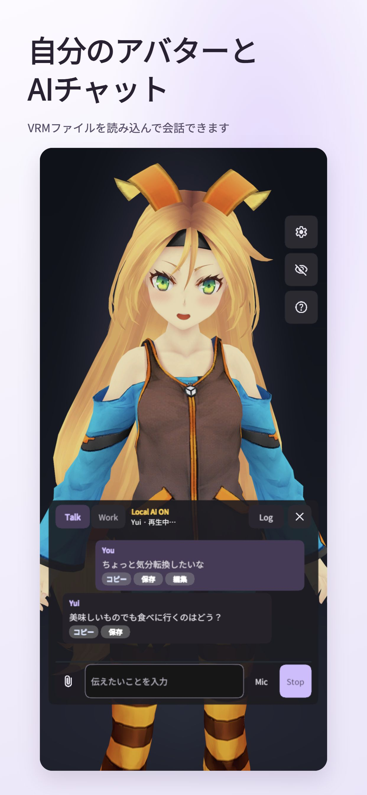
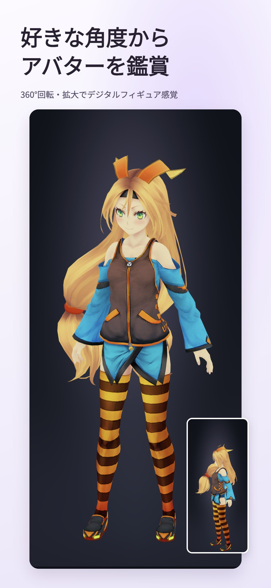
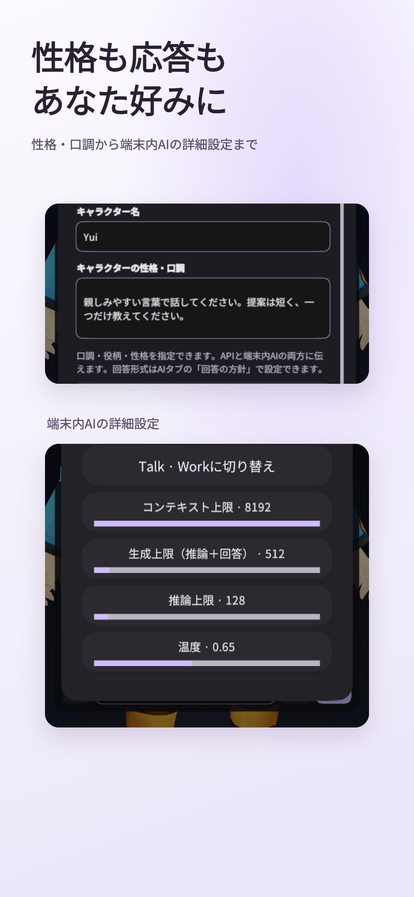
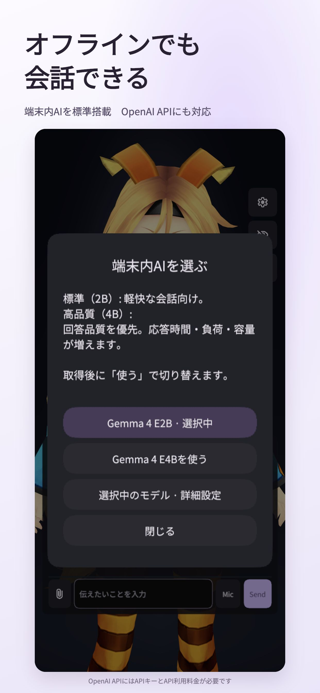

# Yui VRM AI Studio

[English](README.en.md) · [ヘルプ](docs/HELP.md) · [不具合報告](https://github.com/Tsubame-chan/YuiVRMAIStudio/issues)

**お気に入りのVRMアバターを会話相手に。**

自分のアバターを読み込んで、AIと雑談や相談、ちょっとした作業ができます。性格や話し方を文章で設定すれば、あなた好みの相手に。アバターがない方も、付属のUnityちゃんですぐに始められます。

  
  

## できること

- **外見を持ち込む。** VRMアバターを読み込めます。衣装を変えるときも、同じキャラクターの性格と記憶を保てます。
- **性格や話し方を決める。** 「もっとフレンドリーに」「結論から答えて」などを自由に指定。ローカルAIの細かい設定も調整できます。
- **会話を続ける。** キャラクターごとの記憶を端末に保存し、再起動やAIの切替後も会話に使います。記憶は確認・編集・削除できます。
- **好きな角度から眺める。** 会話の合間には、回転・拡大できる鑑賞モードへ。デジタルフィギュアとしても楽しめます。

性格設定・AI選択の画面を見る

  
  

画像は付属Unityちゃんを使った実アプリの画面です。端末やウィンドウサイズによって配置が変わります。

## ダウンロード

| お使いの端末 | 入手先 |
| --- | --- |
| Mac | [macOS版 ZIP](https://github.com/Tsubame-chan/YuiVRMAIStudio/releases/download/v0.2.5-beta.1/YuiVRMAIStudio_MacOSPublicBeta_v0.2.5-beta.1_macos.zip)（Apple Silicon向け） |
| Windows | [Windows版 ZIP](https://github.com/Tsubame-chan/YuiVRMAIStudio/releases/download/v0.2.5-beta.1/YuiVRMAIStudio_WindowsPublicBeta_v0.2.5-beta.1_windows.zip) |
| iPhone / iPad | iOS 26以降。[App Store](https://apps.apple.com/jp/app/id6815341780)（日本向け無料版） |

iPhone / iPad版 **0.2.4** はApp Storeで公開中です。デスクトップ版は **v0.2.5-beta.1** です。Backendの管理画面・保存した声・端末同期が使えます。[Backendの使い方](docs/BACKEND_CONSOLE.md)。ZIPを展開して起動し、初回の案内に沿って必要データを取得してください。約2.5GBの通信と展開用の空き容量が必要です。Wi-Fiをおすすめします。Mac版の署名・公証は未整備です。詳しい起動手順は [Mac](docs/MAC_PUBLIC_BETA.md) / [Windows](docs/SETUP_GUIDE.md)へ。

**GitHubの「Code → Download ZIP」はソースコードです。** アプリを使う方は上のリンクからダウンロードしてください。

## 始め方

1. メッセージを送ると会話が始まります。短い会話はTalk、詳しい相談や作業はWorkを選びます。
2. 設定から性格・声・アバターを変えられます。自分のアバターには **VRMファイル** が必要です。[VRMの用意と読み込み](docs/AVATAR_IMPORT.md)。
3. 操作に迷ったら、ヘルプからチュートリアルを開けます。

AIは、**オフラインで使える端末内AI** と **OpenAI API** を選べます。端末内AIは軽量なE2Bが標準。Mac・iOSでは、より高品質なE4Bを設定から追加できますが、待ち時間や端末の負荷が増えます。高品質な会話にはOpenAI APIをおすすめします。**APIキーとAPI利用料金が必要**で、ChatGPTの契約とは別です。

標準の声は日本語VOICEVOXの5声です。最新ソースではMac・iOSの設定から、日本語Irodoriの3声（約1.96GB）と英語Kokoroの6声（約67.4MB）を任意に追加できます。既存の配布版0.2.4・デスクトップbeta.2にはこの追加音声機能は含まれません。[音声データの取得](docs/LOCAL_AI_ASSETS.md)。PCのバックエンドに接続する拡張機能については[ヘルプ](docs/HELP.md)、Backendの操作は[コンソール案内](docs/BACKEND_CONSOLE.md)、追加エンジンの導入は[音声導入ガイド](docs/BACKEND_TTS_GUIDE.md)を参照してください。

## 0.2.5の更新内容

- 日本語Irodoriの3声と英語Kokoroの6声を任意に追加。Irodoriの初期声は「明るく元気な女性」です。
- 設定・説明画面のスクロールバーを細く統一し、モデル詳細を1つのスクロールで操作できるように改善。
- Mac BackendのIrodoriをV4.1へ更新し、同じ3声のプリセットを追加。

デスクトップ版には上記の更新を反映しています。iOS 0.2.5はAppleへアップロード済みです。App Storeで現在配布中の0.2.4には含まれません。Windows版の実機検証は未実施です。Irodori V4.1のNVIDIA向け追加モデルは [導入手順](docs/IRODORI_TTS_WINDOWS_NVIDIA.md) を参照してください。

## 記憶とプライバシー

記憶はキャラクターごとに分かれます。同期に対応したアプリでは、端末をBackendへ登録し、変更を確認してから人格・記憶・履歴を共有できます。対応版と手順は[端末ごとの対応](docs/RUNTIME_SUPPORT.md)を参照してください。シークレットモードでは既存の記憶を参照し、新しい会話は保存しません。外部APIを選ぶと、会話や関連する性格設定・記憶をそのサービスへ送信します。

AIの回答や記憶の参照には誤りがあります。重要な内容は確認してください。[記憶の仕組み](docs/CONVERSATION_IDENTITY.md) · [プライバシー](docs/PRIVACY.md)

[端末ごとの対応](docs/RUNTIME_SUPPORT.md) · [AI・音声データの取得](docs/LOCAL_AI_ASSETS.md)
